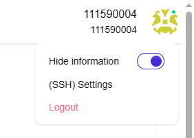
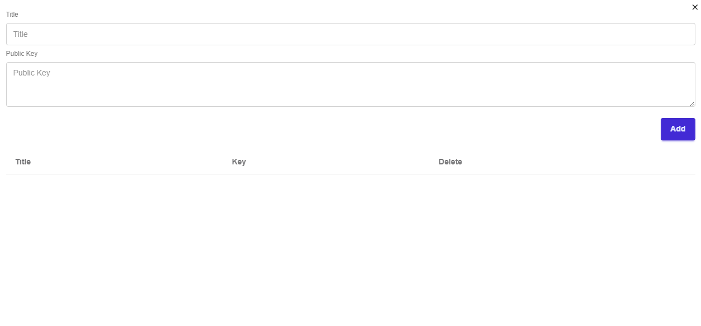

# Homework 00

> 這份作業由物件導向程式設計助教群所製。
> 如有問題，歡迎使用以下方式聯繫：
> MS Teams、Discord群組  
> email: t111590004@ntut.org.tw、t112820018@ntut.org.tw  

⚠️ Due: 2025/09/18 11:59 p.m. ⚠️

## 說明

### 目標

- [ ] 了解並使用 Git
- [ ] 了解並學會使用 課堂評測系統

### 檔案架構

請確認提交是否符合以下的檔案架構，否則無法進行評分。

```txt
./
├── CMakeLists.txt
├── .clang-format
├── README.md
├── LICENSE
├── .gitignore
├── cmake
│    └── Dependencies.cmake
├── files.cmake
├── include
│    └── hello_OOP.hpp
├── src
│    └── hello_OOP.cpp
└── test
     ├── ut.sanity_check.cpp
     └── ut_hello_OOP.cpp
```

## 題目評分

- ［100 分］取得綠勾勾

## 注意事項

- 你不應該上傳 `/bin` 資料夾至專案上。
  - 你的功課不應該出現 Memory Leak，否則將會扣作業總分 10 分。
  - 你不應該上傳 `/bin` 資料夾至專案庫，編譯結果不應該上傳至專案庫上，若在助教確認功課評分時 `/bin` 資料夾存在在專案庫中，扣除作業總分 5 分。

## 敘述

> 嗨，歡迎參加 OOP 課程。
>
> 想必你已經完成了第一週的課程，並已經瞭解這一門課環境相關的設施（若還不了解的話，可以看一下第一週第一堂的簡報）
>
> 在這個任務中，你會了解如何透過命令的方式操作 Git 工具，期望你可以在這一個功課上更佳瞭解作業相關的環境，GL & HF！

Uriah 是 OOP 的一位學生，接下來他將會帶著你一起完成這份作業。

請嘗試完成任務，並在 OJ 上拿到綠色的 Correct 勾勾。

## 題目敘述

在這個任務中，你會擁有一個你自己的功課版本庫（Repository），他會叫做 `OOP2024f_HWX`，接著你就能根據以下的任務開始逐一完成。

### 任務零、上傳 `ssh-key` 到 `gitea` 網站中

如果你觀察 `~/.ssh` 底下是沒有 `id_rsa.pub` 等金鑰的檔案。那麼你需要完整看完任務零。

- 生成 `ssh key`

```sh
ssh-keygen

#出現了 ~/.ssh/id_rsa.pub
```

- 顯示 ssh-key

```sh
cat ~/.ssh/id_rsa.pub
```

- 複製顯示的文字到 `OJ`上

  > 登入 `OJ` >> 右上角頭像 >> (SSH) Settings 



  並貼上金鑰後。



- 出現以下訊息就代表成功了

```sh
➜ ssh -T git@gitea.is1ab.com
Hi there, <學號>! You've successfully authenticated with the key named macbook, but Gitea does not provide shell access.
If this is unexpected, please log in with password and setup Gitea under another user.
```

### 任務一、利用 `git clone` 下載作業

首先，我們要先將 Gitea 上的遠端版本庫下載至我們的本地端，他就像是從 Gitea 下載檔案下來一樣，我們可以使用 `git clone` 來下載專案。

在這之前，我們先來使用 `git clone` 將作業下載至本地端吧！透過以下的指令來將作業下載至本地端。

```bash=
git clone git@gitea.is1ab.com:<學號>/OOP2025f_HW0.git
```
兩者使用其中一個即可，你可以於該 `Question` 頁面的右下角找到該版本庫下載連結。
透過這個指令後，你就能夠將遠端專案庫下載至本地端，並且它已經預先幫你設置好了遠端版本庫為 `https://gitea.is1ab.com/<學號>/OOP2025f_HW0.git`。

當你使用 `git push` 時，他會將變更推送至遠端版本庫上。

### 任務二、在本地上編譯運行專案

接下來的作業（Homework 00 至 Homework 07）將會透顧 `CMake` 進行建構與運行。

CMake 是一個建構工具，透過該建構工具，我們可以較輕鬆的編譯原始碼，變成可執行檔。

在這個任務中，你將需要透過 CMake 編譯作業檔案，並確保他能夠正確地被編譯與執行。

對於作業相關的環境設置，請參考 [Environment Setup](https://hackmd.io/@OOP2023f/rk2-8cVCh)。  
~~(如果你真的很懶的話，可以使用 `Clion` 即可)~~

請在 `src/hello.cpp` 中，將第 `4` 行程式碼註解拔掉。  
並且確認可以通過編譯。

### 任務三、推送分支

當你確認完成，專案都已實作完畢。設定也都完成時，就可以推送變更到遠端的 Git 倉庫中了。

接下來你需要把此項專案重新上傳的自己的專案庫上面。之後就會觸發 Jenkins 的檢查。

注意！ 你上傳的文件為這份專案，而非自己寫一個`main.cpp` 上傳上去。

```
git remote set-url origin git@gitea.is1ab.com:<學號>/OOP2025f_HW0.git
```

```

git add .

```

```

git commit -m "Add homework files"

```

```bash
git push origin main
```

### 任務五、查看 OJ 上是否有評分紀錄

當你推送完成後，請刷新自己的 `OJ` 頁面，如果有提交紀錄並且為 `100` 的話，那麼恭喜你完成本次作業。

### 附註

你仍可以於 [gitea](https://gitea.is1ab.com) 查看自己的提交紀錄。  
帳號密碼與 `OJ` 依然相同。  
只是在大部分狀況下，你不需要這麼做。  

## Homework's meme


